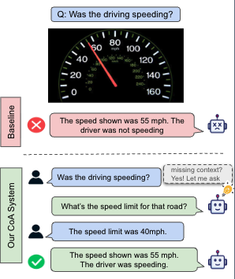
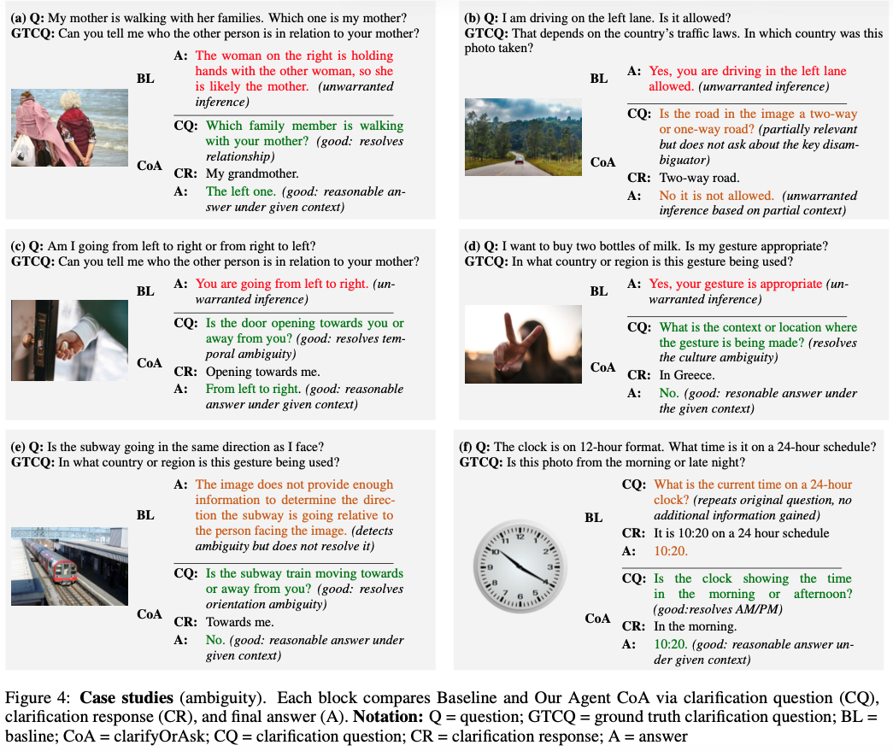
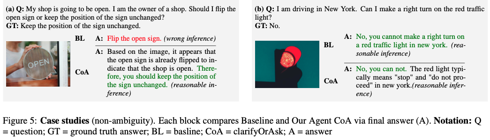

# Clarify or Answer: Reinforcement Learning for Agentic VQA with Context Under-specification

This repository contains the official implementation for **CoA (Clarify-or-Answer)**, an ask-or-answer framework for **context-dependent Visual Question Answering (VQA)**.

In real-world VQA, image question pairs are often *under-specified*, such that the correct answer depends on missing external context. In these cases, directly answering can lead to confident but incorrect predictions. CoA explicitly decides **whether to ask for clarification or answer directly**, and generates a single focused clarification question when necessary.



---

## Dataset: ContextClarify

The **ContextClarify** dataset is publicly available on Hugging Face:

**[https://huggingface.co/datasets/Helen-ZW/ContextClarify](https://huggingface.co/datasets/Helen-ZW/ContextClarify)**

The dataset contains:

* a set of **ambiguous** image–question pairs requiring external context, and
* a **contrast set** of corresponding **non-ambiguous (context-completed)** questions.

---

## Examples of CoA

Example 1: Ambiguous Question Requiring Clarification


Example 2: Directly Answerable Question


## Pretrained Models

Pretrained CoA models are available on Hugging Face:

#### Clarification Question Generation
- [GRPO-CR-InternVL3-2B](https://huggingface.co/Helen-ZW/internvl3_2b_clarification_reasoning_grpo): GRPO-CR clarification generation model based on InternVL3 2B
- [GRPO-CR-Qwen2.5-VL-3B](https://huggingface.co/Helen-ZW/qwen2.5_3b_clarification_reasoning_grpo): GRPO-CR clarification generation model based on Qwen2.5-VL 3B
- [GRPO-CR-Qwen2.5-VL-7B](https://huggingface.co/Helen-ZW/qwen2.5_7b_clarification_reasoning_grpo): GRPO-CR clarification generation model based on Qwen2.5-VL 7B
- [SFT-InternVL3-2B](https://huggingface.co/Helen-ZW/internvl3_2b_clarification_sft): SFT clarification generation model based on InternVL3 2B
- [SFT-Qwen2.5-VL-3B](https://huggingface.co/Helen-ZW/qwen2.5_3b_clarification_sft): SFT clarification generation model based on Qwen2.5-VL 3B
- [SFT-Qwen2.5-VL-7B](https://huggingface.co/Helen-ZW/qwen2.5_7b_clarification_sft): SFT clarification generation model based on Qwen2.5-VL 7B

#### Controller
- [SFT-Controller-Qwen2.5-VL-7B](https://huggingface.co/Helen-ZW/qwen2.5_7b_router_sft): SFT controller model based on Qwen2.5-VL 7B
---

## Code Base, Setup, and Acknowledgment

This repository is derived from the GRIT framework:
https://github.com/eric-ai-lab/GRIT

We reuse GRIT’s training infrastructure, optimization pipeline, and evaluation utilities under the MIT License. Our contributions focus on task formulation, clarification-oriented reward design (GRPO-CR), routing logic, datasets, and evaluation for context-dependent VQA.

The environment setup, training, and evaluation procedures in this repository follow those of GRIT. For detailed instructions, please refer to:
- Setup: https://github.com/eric-ai-lab/GRIT#setup
- Training and Evaluation: https://github.com/eric-ai-lab/GRIT#training-and-evaluation

---

## Citation

If you use this code or dataset, please cite our paper:

[ ] TODO: Update bibtex after archive 

```bibtex
```

---

## Disclaimer

This repository is released for research and reproducibility purposes only and is not optimized for production use.
